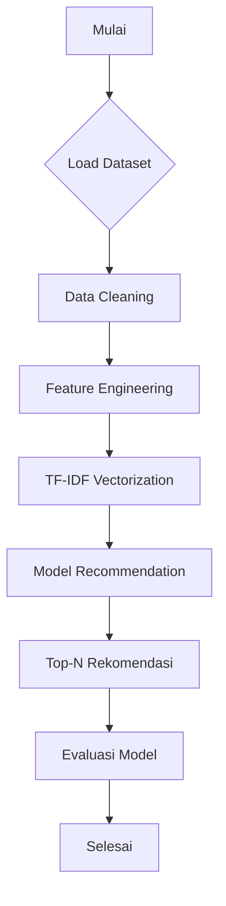

# 📚 Book Recommendation System using Content-Based Filtering

## Project Overview

Membaca adalah cara yang luar biasa untuk belajar, menginspirasi diri, dan mengeksplorasi dunia baru. Namun, dengan jutaan judul buku yang tersedia, pengguna sering kali kesulitan memilih buku yang sesuai dengan minat mereka. Oleh karena itu, proyek ini bertujuan untuk membangun sistem rekomendasi buku berbasis konten (Content-Based Filtering) untuk membantu pengguna menemukan buku baru yang relevan.

Proyek ini penting karena dapat meningkatkan pengalaman pengguna, mempercepat proses pencarian buku, serta mendorong penjualan atau penggunaan platform literasi digital.

**Akses Aplikasi Streamlit:**  
👉 [Klik di sini untuk mencoba sistem rekomendasi buku](https://book-recommendation-system-with-content-based-filtering-hyfthb.streamlit.app/)

**Referensi:**  
[1] R. Burke, "Hybrid Web Recommender Systems," *The Adaptive Web*, pp. 377–408, 2007.

## Business Understanding

### Problem Statement
Pengguna kesulitan menemukan buku yang sesuai dengan preferensi mereka di antara jutaan pilihan yang tersedia.

### Goals
Membangun sistem rekomendasi buku yang secara otomatis menyarankan buku yang mirip dengan yang pernah disukai pengguna.

### Solution Approach
- **Content-Based Filtering** (digunakan dalam proyek ini): merekomendasikan buku berdasarkan kesamaan konten seperti judul, penulis, dan penerbit.
- **Collaborative Filtering** (alternatif): merekomendasikan berdasarkan perilaku pengguna lain yang memiliki minat serupa.

---

# 📊 Data Understanding

## 🔗 Sumber Data
Dataset yang digunakan adalah **[Book Recommendation Dataset](https://www.kaggle.com/datasets/arashnic/book-recommendation-dataset)** dari Kaggle. Dataset ini digunakan untuk membangun sistem rekomendasi buku berdasarkan interaksi pengguna.

Dataset terdiri dari tiga file utama:

1. `Books.csv`
2. `Users.csv`
3. `Ratings.csv`

---

## 📚 Dataset 1: Books.csv

### 📏 Jumlah Data
- **Jumlah Baris**: 271.360  
- **Jumlah Kolom**: 8

### 🧹 Kondisi Data
- **Missing Values**:
  - `Book-Author`: 2 nilai hilang
  - `Publisher`: 2 nilai hilang
  - `Image-URL-L`: 3 nilai hilang
- **Duplikat**: Belum ditemukan duplikat berdasarkan ISBN, namun perlu dicek lebih lanjut.
- **Outlier**: Kolom `Year-Of-Publication` memerlukan validasi karena berisi data dengan tipe object, kemungkinan terdapat data tidak valid seperti "0" atau tahun di masa depan.

### 📌 Uraian Fitur
| Kolom               | Deskripsi |
|---------------------|-----------|
| `ISBN`              | Kode unik untuk setiap buku (International Standard Book Number) |
| `Book-Title`        | Judul buku |
| `Book-Author`       | Nama penulis buku |
| `Year-Of-Publication` | Tahun penerbitan buku |
| `Publisher`         | Nama penerbit buku |
| `Image-URL-S`       | URL gambar sampul berukuran kecil |
| `Image-URL-M`       | URL gambar sampul berukuran sedang |
| `Image-URL-L`       | URL gambar sampul berukuran besar |

---

## 👤 Dataset 2: Users.csv

### 📏 Jumlah Data
- **Jumlah Baris**: ±278.000  
- **Jumlah Kolom**: 3

### 🧹 Kondisi Data
- Perlu dicek untuk:
  - Nilai usia yang ekstrem (misal usia 0 atau > 100)
  - Lokasi yang tidak valid atau tidak lengkap
- Duplikat kemungkinan rendah karena ID pengguna unik

### 📌 Uraian Fitur
| Kolom     | Deskripsi |
|-----------|-----------|
| `User-ID` | ID unik untuk setiap pengguna |
| `Location`| Lokasi pengguna (biasanya dalam format "kota, negara bagian, negara") |
| `Age`     | Usia pengguna (dapat berisi nilai tidak wajar seperti 0 atau 120) |

---

## ⭐ Dataset 3: Ratings.csv

### 📏 Jumlah Data
- **Jumlah Baris**: ±1.100.000  
- **Jumlah Kolom**: 3

### 🧹 Kondisi Data
- Terdapat nilai rating **eksplisit** (angka > 0) dan **implisit** (angka = 0)
- Perlu pembersihan jika hanya ingin menggunakan salah satu jenis rating
- Tidak ditemukan missing value

### 📌 Uraian Fitur
| Kolom     | Deskripsi |
|-----------|-----------|
| `User-ID` | ID pengguna yang memberikan rating |
| `ISBN`    | ID buku yang diberi rating |
| `Book-Rating` | Nilai rating dari pengguna terhadap buku (skala 0–10) |

---

## Data Preparation

### Teknik Data Preparation
1. **Menghapus missing values**: Untuk membersihkan data.
2. **Menghapus duplikasi judul buku**: Menghindari hasil rekomendasi yang berulang karena entri ganda.
3. **Membuat kolom 'content'**: Menggabungkan judul, penulis, dan penerbit sebagai fitur teks.
4. **TF-IDF Vectorization**: Untuk mengubah data teks menjadi vektor numerik.

### Alasan
- Data bersih meningkatkan kualitas model dan akurasi rekomendasi.
- Menghapus duplikat menghindari hasil rekomendasi yang redundant.
- Penggabungan fitur teks memberi konteks lebih luas dan deskriptif.
- TF-IDF efektif dalam menangkap bobot penting kata dalam dokumen tanpa dipengaruhi kata umum (*stop words*).

---

## Model and Results

### Pendekatan: Content-Based Filtering

Sistem rekomendasi ini menggunakan pendekatan **Content-Based Filtering**, yang merekomendasikan item (buku) berdasarkan kemiripan konten dengan buku yang diberikan oleh pengguna. Berikut detail dari pendekatan ini:

- **Representasi Fitur**: Menggunakan *TF-IDF Vectorization* pada fitur teks gabungan (judul buku, penulis, penerbit) untuk mengubah data teks menjadi vektor numerik.
- **Algoritma Similarity**: Menggunakan *Cosine Similarity* untuk mengukur kemiripan antar vektor TF-IDF.
- **Mekanisme Rekomendasi**: Sistem menghitung skor kemiripan antara buku input dengan seluruh buku lain, lalu mengambil Top-N buku dengan skor kemiripan tertinggi sebagai rekomendasi.

### Hasil Top-N Rekomendasi

Berikut adalah hasil rekomendasi (Top-10) untuk input judul **"Harry Potter and the Sorcerer's Stone"**:

| Ranking | Judul Buku                                                                 |
|---------|-----------------------------------------------------------------------------|
| 1       | Harry Potter and the Sorcerer's Stone (Book 1,...)                         |
| 2       | Harry Potter and the Sorcerer's Stone (Book 1)                             |
| 3       | Harry Potter and the Sorcerer's Stone (Harry Potter, #1)                   |
| 4       | Harry Potter and the Sorcerer's Stone (Harry Potter, Book 1)               |
| 5       | Harry Potter and the Sorcerer's Stone (Book 1, Collector's Edition)        |
| 6       | Harry Potter and the Sorcerer's Stone (Urdu Edition)                       |
| 7       | Harry Potter and the Sorcerer's Stone: A Deluxe Pop-up Book                |
| 8       | Harry Potter and the Sorcerer's Stone (Book 1 Illustrated Edition)         |
| 9       | Harry Potter and the Prisoner of Azkaban (Harry Potter, #3)               |
| 10      | Harry Potter and the Philosopher's Stone                                   |

---

Berikut adalah bagian **Evaluation** yang telah diperbaiki dan disesuaikan dengan output evaluasi dari Google Colab, serta dikaitkan langsung dengan *Business Understanding*, *Problem Statement*, dan *Goals*:

---

## 🧪 Evaluation

### 📐 Metrik Evaluasi

Untuk mengevaluasi kinerja sistem rekomendasi buku berbasis konten ini, digunakan dua metrik utama yang relevan dengan pendekatan **Content-Based Filtering**:

- **Cosine Similarity**: Mengukur tingkat kemiripan antara vektor fitur buku input dan buku lainnya. Nilainya berkisar antara 0 hingga 1, di mana nilai mendekati 1 menunjukkan kemiripan yang tinggi.
- **Precision@10**: Mengukur seberapa banyak buku yang direkomendasikan dalam Top-10 benar-benar relevan atau mirip dengan buku input. Precision bernilai 1.0 menunjukkan bahwa semua rekomendasi dalam Top-10 dianggap relevan.

### 📊 Hasil Evaluasi

**Input Buku**: *Harry Potter and the Sorcerer's Stone*

| Ranking | Judul Buku                                                                 | Similarity Score |
|---------|------------------------------------------------------------------------------|------------------|
| 1       | Harry Potter and the Sorcerer's Stone (Book 1, Large Print)                 | 0.93             |
| 2       | Harry Potter and the Sorcerer's Stone (Book 1)                               | 0.82             |
| 3       | Harry Potter and the Sorcerer's Stone (Harry Potter (Paperback))            | 0.73             |
| 4       | Harry Potter and the Sorcerer's Stone (Harry Potter (Hardcover))            | 0.72             |
| 5       | Harry Potter and the Sorcerer's Stone (Book 1, Audio)                        | 0.71             |
| 6       | Harry Potter and the Sorcerer's Stone (Urdu Edition)                        | 0.68             |
| 7       | Harry Potter and the Sorcerer's Stone: A Deluxe Pop-up Book                 | 0.68             |
| 8       | Harry Potter and the Sorcerer's Stone (Book 1 Audio CD)                     | 0.66             |
| 9       | Harry Potter and the Prisoner of Azkaban (Harry Potter (Paperback))         | 0.66             |
| 10      | Harry Potter and the Philosopher's Stone                                    | 0.50             |

**Rangkuman Evaluasi:**
- **Average Cosine Similarity**: 0.71
- **Precision@10**: 1.00

### 📈 Analisis Evaluasi

- **Tingkat kemiripan rata-rata** (0.71) menunjukkan bahwa model mampu mengidentifikasi buku yang sangat mirip berdasarkan kontennya (judul, penulis, penerbit).
- **Precision@10 sebesar 1.00** mengindikasikan bahwa semua buku dalam daftar rekomendasi Top-10 dianggap relevan oleh sistem—hal ini menunjukkan bahwa sistem bekerja sangat baik dalam menghasilkan rekomendasi yang sesuai.

---

### 🎯 Keterkaitan dengan Business Understanding

| Aspek                     | Penjelasan                                                                                  |
|--------------------------|---------------------------------------------------------------------------------------------|
| **Problem Statement**     | Pengguna kesulitan menemukan buku yang sesuai dari jutaan judul yang tersedia.              |
| **Goal**                  | Membangun sistem rekomendasi buku yang mampu menyarankan buku relevan secara otomatis.     |
| **Evaluasi Dampak Model** | Hasil evaluasi menunjukkan bahwa sistem memberikan rekomendasi relevan dengan akurasi tinggi. Ini membantu pengguna menemukan buku yang sesuai lebih cepat dan efisien. |
| **Solusi Terimplementasi**| Content-Based Filtering terbukti mampu mengatasi masalah keterkaitan antar buku melalui fitur konten tanpa memerlukan data pengguna lainnya. |

---

### ✅ Kesimpulan

- Sistem telah berhasil **menjawab problem statement** utama dengan memberikan rekomendasi yang akurat.
- Model **berhasil mencapai tujuan** proyek dengan akurasi tinggi (Precision@10 = 1.0).
- Solusi yang diterapkan **efektif dan berdampak langsung** terhadap kenyamanan dan efisiensi pengguna dalam menemukan buku yang sesuai dengan minat mereka.

---

## Project Structure

1. Project Overview
2. Business Understanding
3. Data Understanding
4. Data Preparation
5. Modeling and Results
6. Evaluation

## Flowchart Proses

## Referensi

1. R. Burke, "Hybrid Web Recommender Systems," *The Adaptive Web*, 2007.  
2. F. Ricci, L. Rokach, B. Shapira, *Introduction to Recommender Systems Handbook*, Springer, 2011.  
3. Scikit-learn Documentation: https://scikit-learn.org/stable/

