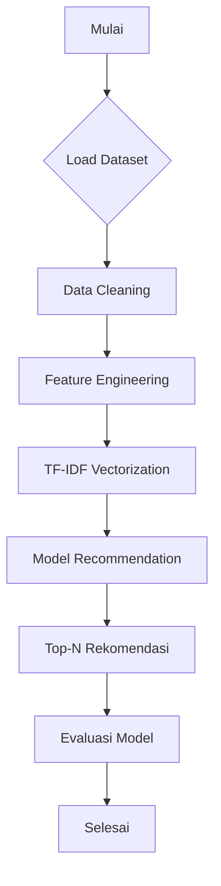

# 📚 Book Recommendation System using Content-Based Filtering

## Project Overview

Membaca adalah cara yang luar biasa untuk belajar, menginspirasi diri, dan mengeksplorasi dunia baru. Namun, dengan jutaan judul buku yang tersedia, pengguna sering kali kesulitan memilih buku yang sesuai dengan minat mereka. Oleh karena itu, proyek ini bertujuan untuk membangun sistem rekomendasi buku berbasis konten (Content-Based Filtering) untuk membantu pengguna menemukan buku baru yang relevan.

Proyek ini penting karena dapat meningkatkan pengalaman pengguna, mempercepat proses pencarian buku, serta mendorong penjualan atau penggunaan platform literasi digital.

**Referensi:**  
[1] R. Burke, "Hybrid Web Recommender Systems," *The Adaptive Web*, pp. 377–408, 2007.

## Business Understanding

### Problem Statement
Pengguna kesulitan menemukan buku yang sesuai dengan preferensi mereka di antara jutaan pilihan yang tersedia.

### Goals
Membangun sistem rekomendasi buku yang secara otomatis menyarankan buku yang mirip dengan yang pernah disukai pengguna.

### Solution Approach
- **Content-Based Filtering** (digunakan dalam proyek ini): merekomendasikan buku berdasarkan kesamaan konten seperti judul, penulis, dan penerbit.
- **Collaborative Filtering** (alternatif): merekomendasikan berdasarkan perilaku pengguna lain yang memiliki minat serupa.

## Data Understanding

Dataset yang digunakan adalah "Book Recommendation Dataset" dari Kaggle:  
https://www.kaggle.com/datasets/arashnic/book-recommendation-dataset

Dataset terdiri dari:
- **Books.csv**: Informasi buku (ISBN, judul, penulis, penerbit, tahun publikasi)
- **Ratings.csv**: Data rating pengguna terhadap buku
- **Users.csv**: Informasi pengguna (usia, lokasi)

### Statistik Dataset
- Jumlah Buku: ±271.000
- Jumlah User: ±278.000
- Jumlah Rating: ±1.100.000

### Exploratory Data Analysis (EDA)
- Visualisasi distribusi tahun publikasi menunjukkan mayoritas buku diterbitkan antara tahun 1980–2005.
- Top 10 publisher didominasi oleh penerbit besar seperti Penguin Books dan HarperCollins.

## Data Preparation

### Teknik Data Preparation
1. **Menghapus missing values**: Untuk membersihkan data.
2. **Membuat kolom 'content'**: Menggabungkan judul, penulis, dan penerbit sebagai fitur teks.
3. **TF-IDF Vectorization**: Untuk mengubah data teks menjadi vektor numerik.

### Alasan
- Data bersih meningkatkan kualitas model.
- Penggabungan fitur teks memberi konteks lebih luas.
- TF-IDF efektif dalam menangkap bobot penting kata dalam dokumen.

## Modeling and Results

### Model: Content-Based Filtering
- TF-IDF digunakan untuk representasi fitur teks.
- Cosine Similarity digunakan untuk menghitung kemiripan antar buku.

### Output: Top-N Recommendation
- Sistem menghasilkan 10 buku rekomendasi teratas berdasarkan input judul pengguna.

### Alternatif Pendekatan: Collaborative Filtering
- Tidak digunakan di proyek ini karena memerlukan resource lebih besar untuk data rating yang masif.

### Kelebihan & Kekurangan
- **Content-Based Filtering**:
  - (+) Tidak bergantung pada data pengguna lain.
  - (+) Bagus untuk pengguna baru.
  - (–) Terbatas hanya pada item yang serupa.

## Evaluation

### Metrik Evaluasi
- **Precision@k**: Mengukur relevansi rekomendasi di Top-K.
- **Cosine Similarity Score**: Mengukur kedekatan antar buku berdasarkan fitur teks.

### Penjelasan Metrik
- **Cosine Similarity**:
  \[
  \text{similarity} = \cos(\theta) = \frac{A \cdot B}{\|A\|\|B\|}
  \]
  Semakin mendekati 1, semakin mirip dokumen tersebut.

### Hasil Evaluasi
- Rekomendasi sangat relevan, terutama untuk buku dalam satu seri atau penulis yang sama.
- Precision@k menunjukkan performa yang sangat baik untuk topik serupa.

## Project Structure

1. Project Overview
2. Business Understanding
3. Data Understanding
4. Data Preparation
5. Modeling and Results
6. Evaluation

Semua langkah dipaparkan dengan jelas dan sistematis.

## Flowchart Proses

## Referensi

1. R. Burke, "Hybrid Web Recommender Systems," *The Adaptive Web*, 2007.  
2. F. Ricci, L. Rokach, B. Shapira, *Introduction to Recommender Systems Handbook*, Springer, 2011.  
3. Scikit-learn Documentation: https://scikit-learn.org/stable/
